# 医院挂号小程序系统功能概述

## 1、系统技术架构
该系统采用前后端分离架构，后端基于Spring Boot 3.2.7开发，使用Spring Security进行权限控制，MyBatis-Plus作为ORM框架，JWT实现身份验证，MySQL作为数据库，并集成了Swagger文档、验证码等功能组件。
前端：小程序 、Vue框架
##  2、用户角色功能

### 小程序端用户功能
小程序端面向普通患者用户，提供完整的挂号就医服务体验：
- **账户管理**：用户注册、登录、个人信息维护和密码修改
- **就诊人管理**：支持添加、编辑和管理多个就诊人信息，方便为家人预约
- **挂号服务**：浏览科室列表、医生信息，查看医生排班和剩余号源，选择时间段进行预约挂号
- **预约管理**：查看个人预约记录，支持取消预约
- **就诊记录**：查询历史就诊信息和就诊状态
- **资讯服务**：浏览医院发布的健康资讯和公告信息
- **意见反馈**：提交对医院服务的意见和建议

### Web端管理员功能
管理员负责整个系统的运营和管理工作：
- **系统管理**：用户账号管理、角色权限分配、菜单权限控制
- **医院资源管理**：科室设置、医生信息管理、排班规则制定
- **预约管理**：查看全院预约情况，监控各科室预约状态
- **资讯管理**：发布、编辑和管理医院公告和健康资讯
- **数据统计**：查看挂号数据统计和分析报表
- **系统设置**：配置系统基本参数和运行环境

### Web端医生功能
医生用户主要关注自身的排班和患者管理：
- **个人信息管理**：查看和更新个人资料，修改登录密码
- **排班信息**：查看个人排班安排和预约情况
- **患者管理**：查看预约自己的患者列表
- **叫号功能**：为到院患者进行电子叫号，管理就诊队列
- **就诊记录**：记录患者就诊信息，查看历史就诊记录

## 3、运行效果
### （1）小程序端

---
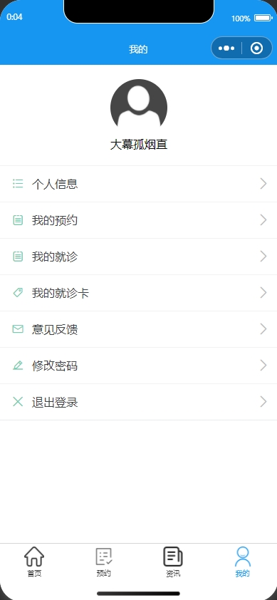---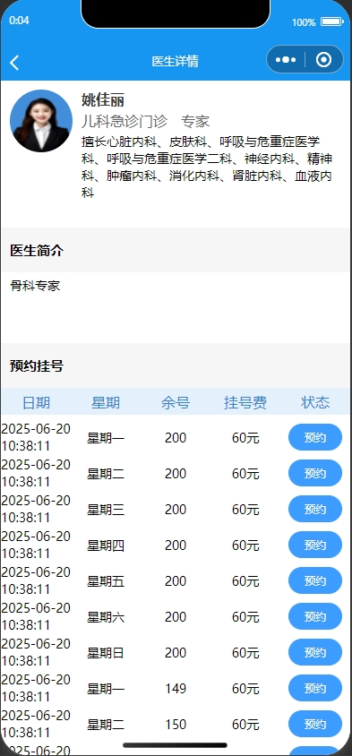
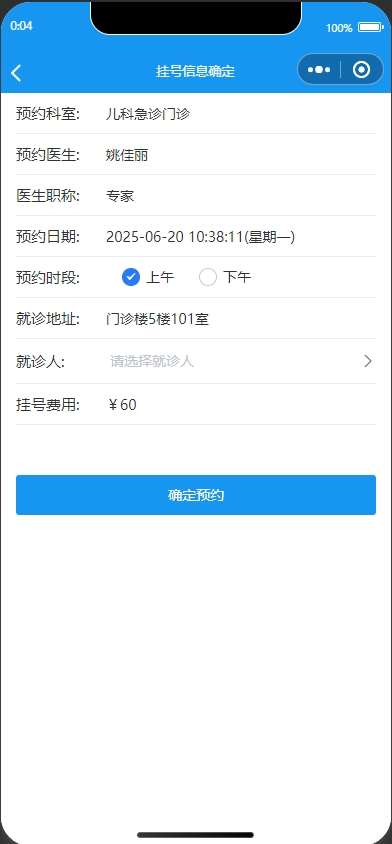---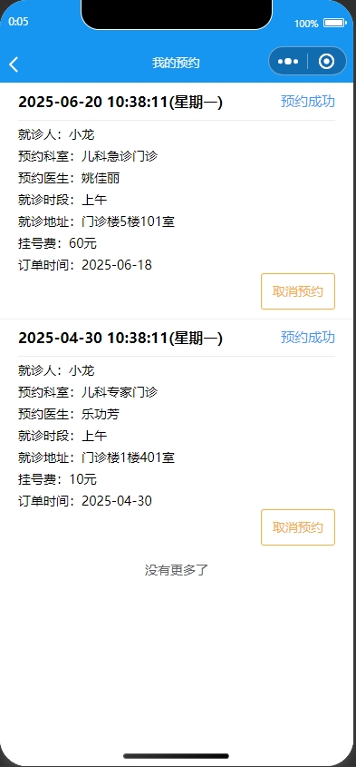
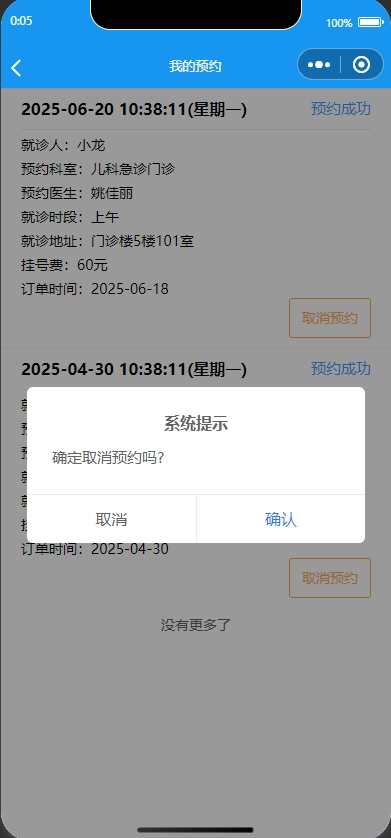---
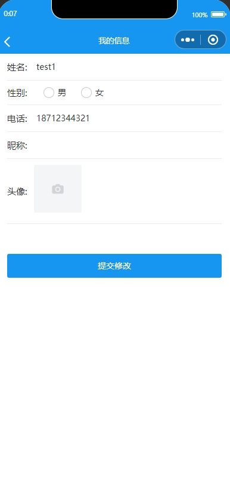---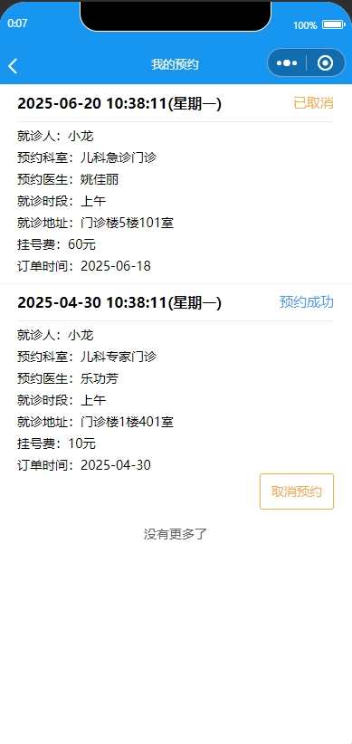
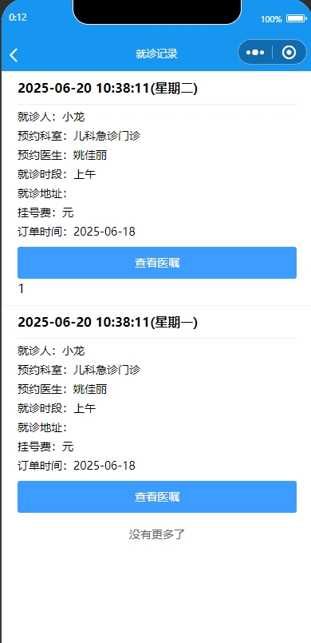---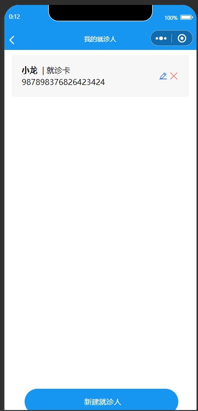
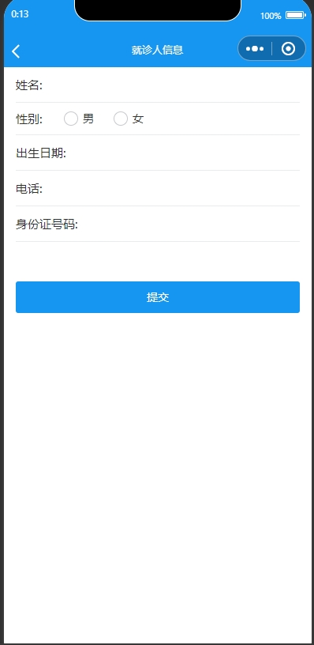---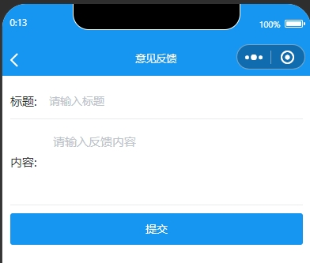
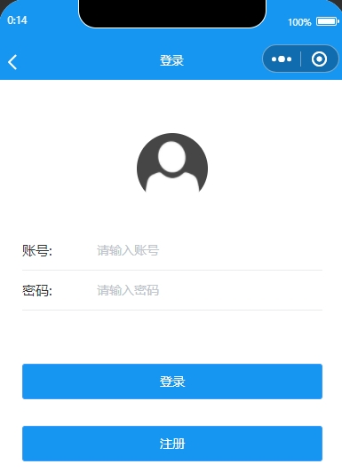---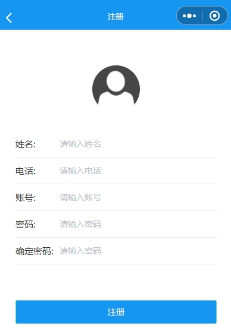
### （2）管理员端

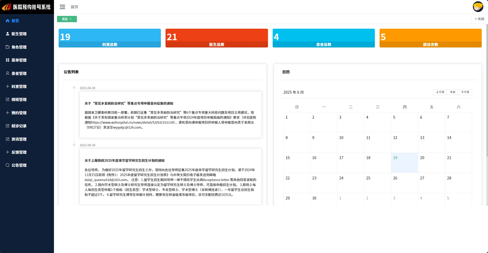
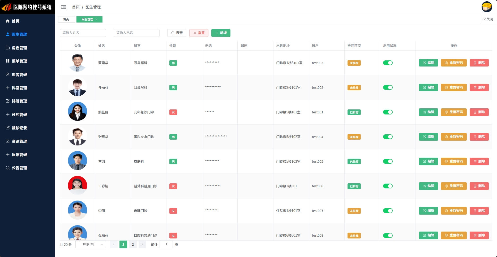
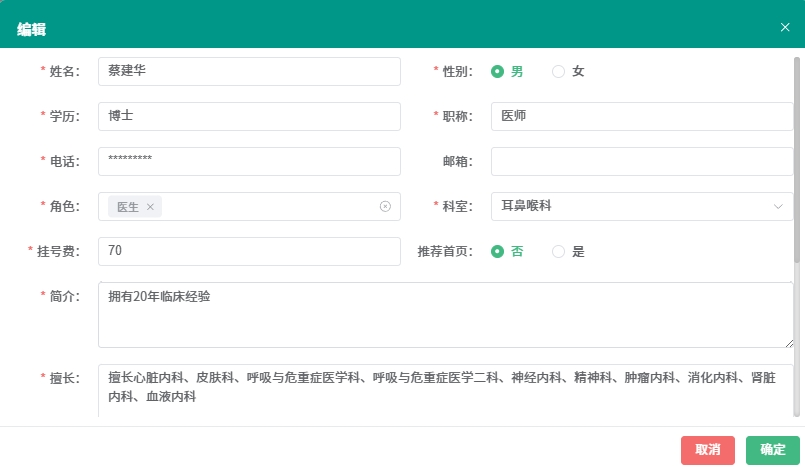
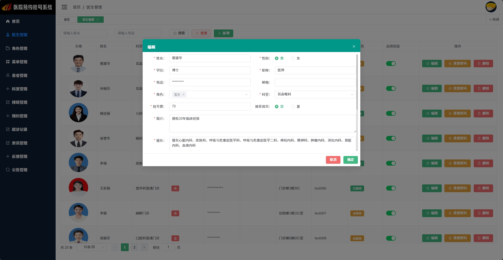
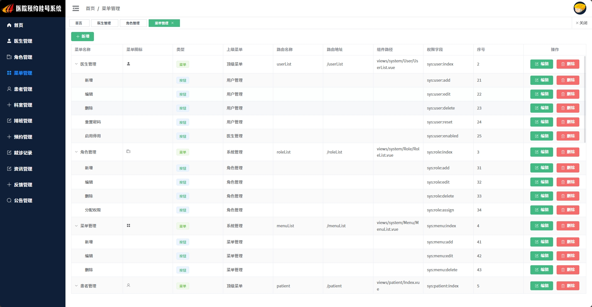
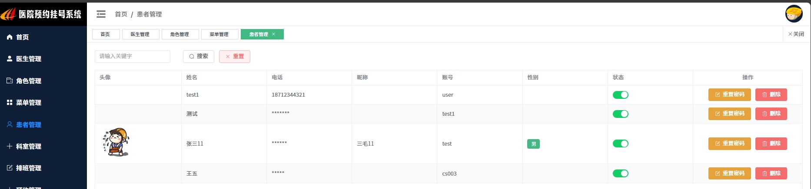
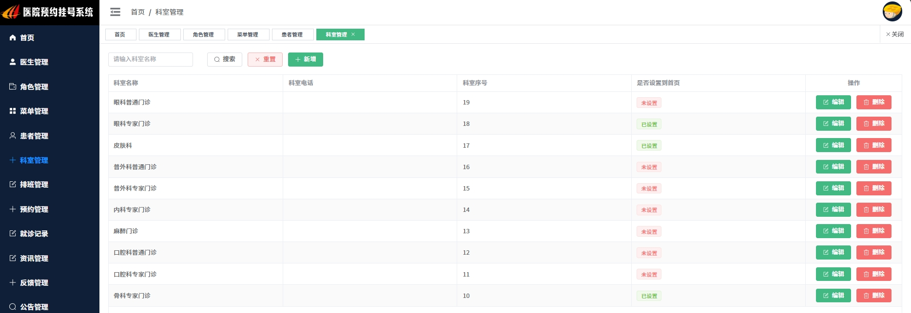
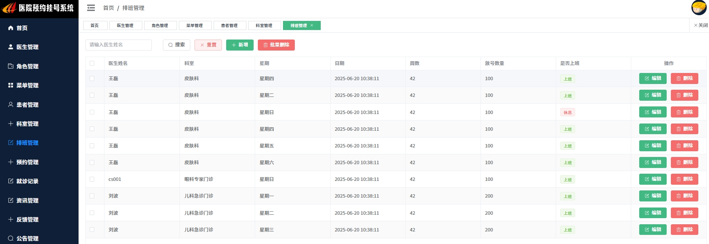

